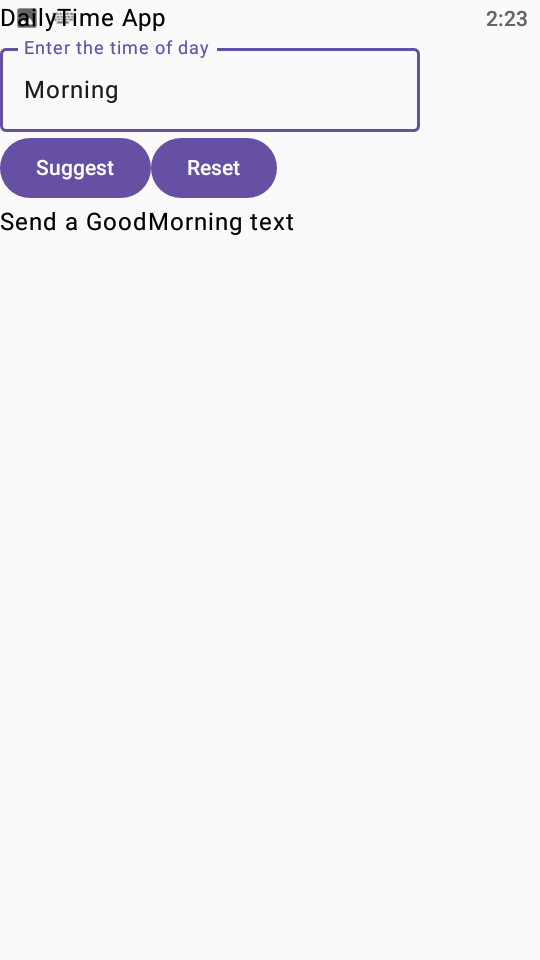

# DailyTime App

## Description

DailyTime App is a simple Android application designed to promote positive social interaction by suggesting meaningful activities based on the time of day. 
It helps users stay socially engaged by providing quick and thoughtful interaction ideas.

## Features

- Allows users to enter a time of the day
- Generates social interaction suggestions instantly
- Provides feedback for invalid input
- Includes a reset button to clear input and results
- Simple, clean, and user-friendly interface

## How to Use

1. Open the application
2. Enter a time of the day (e.g., Morning, Mid-morning, Afternoon, Mid-afternoon, Dinner, Night)
3. Tap the "Suggest" button
4. View the suggested interaction
5. Tap "Reset" to clear input and try again

Note: The application currently accepts only predefined time categories as input
## App Logic

The application uses a "when" statement to match user input and display suggestions:

- Morning → Send a "Good Morning" text
- Mid-morning → Send a text to a friend
- Afternoon → Send stickers to a sibling
- Mid-afternoon → Make yourself some snack
- Dinner → Reach out to a friend and catch up
- Night → Send a goodnight message to a family 
- Invalid input → Displays "Invalid input"

## Built With

- Kotlin
- Android Studio
- Jetpack Compose

## Future Improvements

- Replace text input with a dropdown menu for better usability
- Make input case-insensitive
- Add notifications or reminders
- Improve UI with animations and modern design
- Expand the list of interaction suggestions

## Screenshots

### Empty App Screen

### App in use

## Author

**Koketso M**

## Video Demonstration

Watch my app demo here :
[Click here to view the video](./App Video.mp4)

